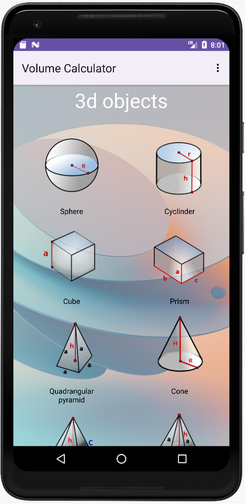

# Volume Calculator

## Installation

https://www.rustore.ru/catalog/app/ru.wizand.volumeareaapp

### This is my project for studying Android development

This app calculate volume for various shapes.

The apk app is in /app/release/

## TODO
- calculate area;
- more data (geometry);
- calculator;
  ~~- round the result;~~
  ~~- menu;~~
  ~~- about section;~~